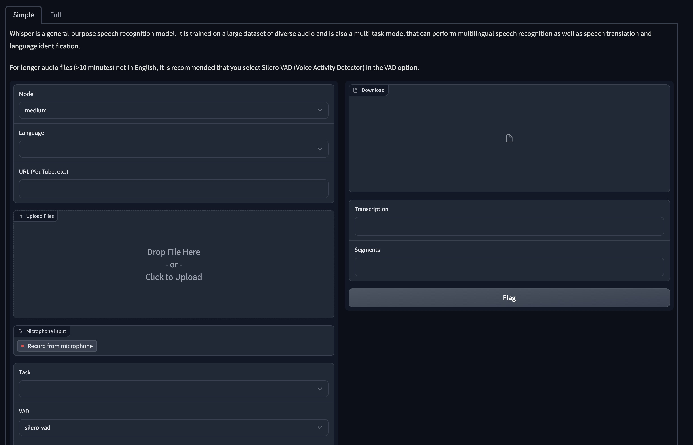

# OpenAI-Whisper 

[OpenAI Whisper](https://github.com/openai/whisper) with Dockerfile and build.envd, code almost from [aadnk](https://gitlab.com/aadnk/whisper-webui/-/tree/main).



## Build

In the `Dockerfile`, you need to define the instructions for building a Docker image that encapsulates the server code and its dependencies.

In most cases, you could use the template in the repository.

```bash
# GPU
docker build -t docker.io/USER/IMAGE -f Dockerfile.gpu .
docker push docker.io/USER/IMAGE
```

On the other hand, a [`build.envd`](https://envd.tensorchord.ai/guide/getting-started.html) is a simplified alternative to a Dockerfile. It provides python-based interfaces that contains configuration settings for building a image. 

It is easier to use than a Dockerfile as it involves specifying only the dependencies of your machine learning model, not the instructions for CUDA, conda, and other system-level dependencies.

```bash
# GPU
envd build --output type=image,name=docker.io/USER/IMAGE,push=true -f :build_gpu
```

## Deploy

Please refer to the [Modelz documentation](https://docs.modelz.ai/gettingstarted/deploy) for more details.
